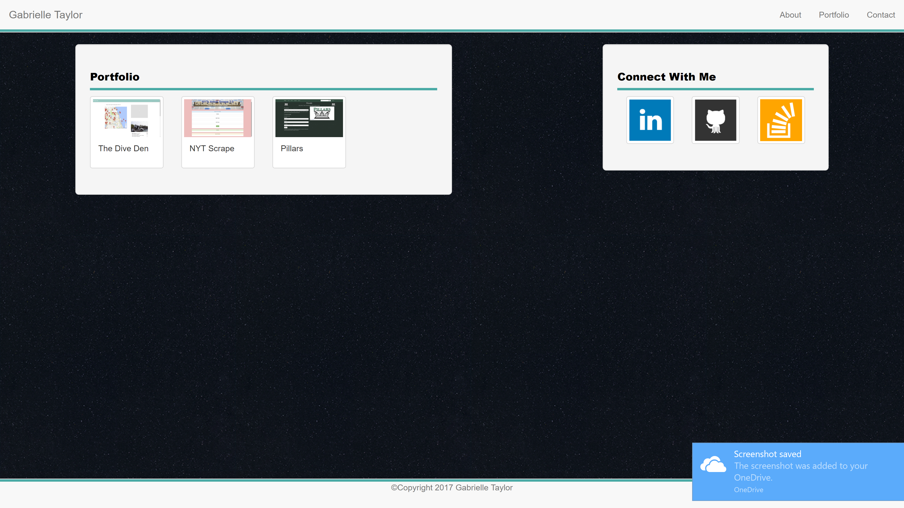
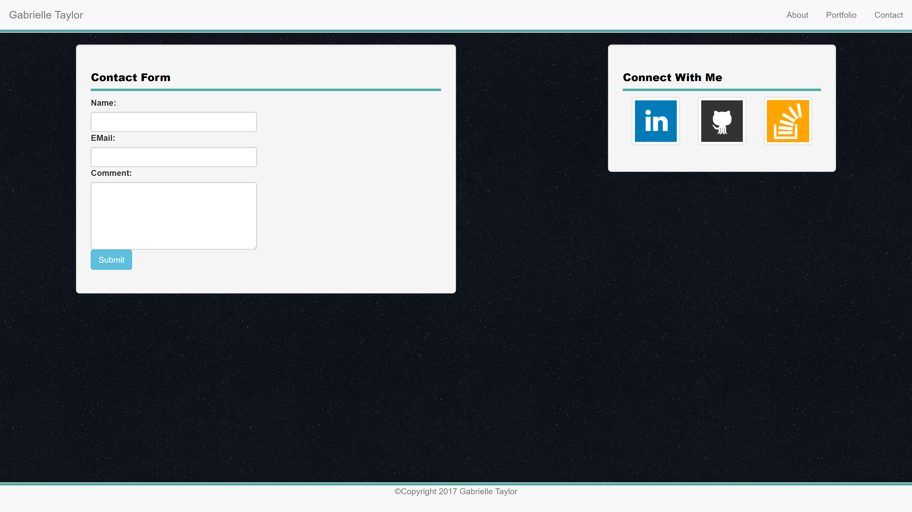

# phpPortfolio

A basic and beginning professional portfolio that was created with the Bootstrap CDN and converted into PHP for routing.
In terminal type php -S localhost:3000 to access files

# About

# Portfolio

# Contact
